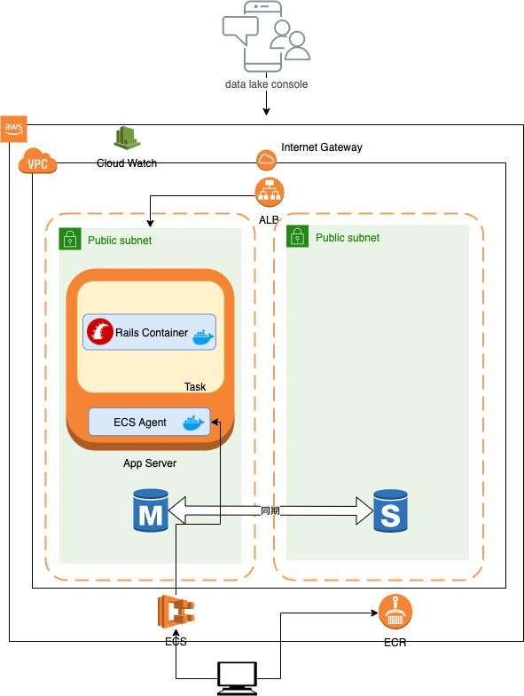

# カフェペディアAPIのTerraform


関連リンク(以下のサービスが乗っています)

https://github.com/hatsu38/cafepedia-api

## Terraformのインストール
```
brew install tfenv
tfenv install
```

## 設定手順
```
cat << EOS > .aws_credentials
[cafepedia-api-tf]
aws_access_key_id     = AKXXXXXXXXXXXXX
aws_secret_access_key = XXXXXXXXXXXXXXXXXXXXXXXXXXXXXXXXX
aws_default_region    = ap-northeast-1
EOS

export AWS_SHARED_CREDENTIALS_FILE="/path/to/.aws-credentials"
export AWS_PROFILE="cafepedia-api-tf"

aws s3 ls # 認証エラーなく正常に動作すること
```

## Terraformのセットアップ
terraformのaws providerをダウンロードする
```
cd terraform/production/ecs/

terraform init
```

## 普段の操作
```
# main.tfがあるフォルダで下記のコマンドが実行できる。

terraform validate

terraform fmt

terraform plan

# ecs フォルダ以下のみ、下記のパラメータの指定が必要。
# tag_id : docker imageのタグ
terraform plan -var 'tag_id=0.0.1'
```

## 新しくサービスを作るとき
#### 構築手順
準備
1. s3バケットをマネージメントコンソールから作成(サービス名で)
2. backends.tfとremote_state.tf の s3バケット名を 1. で作成したバケット名に変更
3. variables.tfのservice_nameを作成するサービスの名前に変更する

Apply
```
cd terraform/production/〇〇
terraform init(Backetにあるtfstateを取り込む)
terraform plan(Applyで生成されるリソースを見る。生成はされない)
terraform apply(Planの通りリソースを作成する)
```

4. SSMのApply(秘密にしたい環境変数を格納)

    4-1. マネージメントコンソールから、SSMの値を更新

5. ECRのApply
6. VPCのApply
7. EC2のApply

    7-1. マネージメントコンソールから、RDSの作成

    7-2. ECRにAppをPush
8. Route53/PublicのApply

    8-1. ホストゾーン作成後、お名前.comなどから名前解決のため移譲をする

9. Route53/AcmのApply

    9-1. 名前解決完了後、TLS証明書の作成が可能

10. ECSのApply

ECRにPushされたImageのバージョンを指定してApply
```
terraform plan -var 'tag_id=○.○.○' -var 'rails_env=qa'
```
